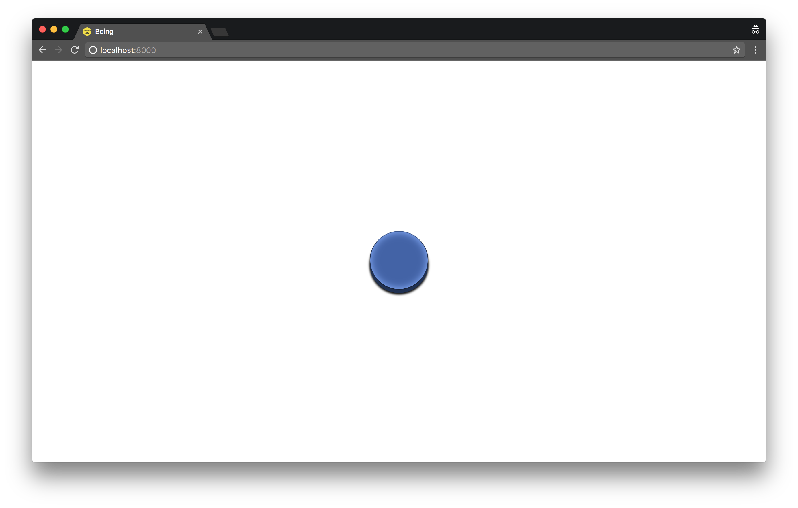

# [Boing](https://ungoldman.github.io/boing)

A big blue button that makes a "boing" sound when you click it.

## About

First published March 2nd, 2014.

This is also a demonstration of using the [`EventListener.handleEvent()`](https://developer.mozilla.org/en-US/docs/Web/API/EventListener/handleEvent) method to create an interactive button component bound to an audio element.

## License

ISC
